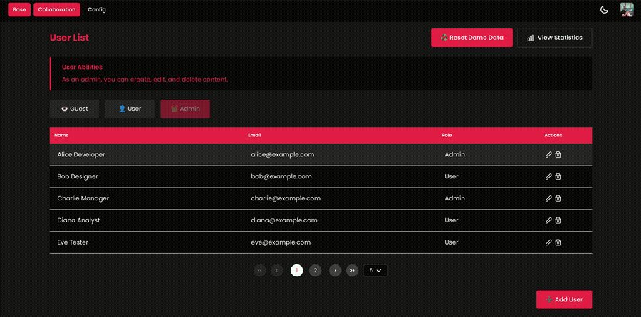

# Admin Dashboard NX Monorepo

A production-ready enterprise admin dashboard built with Angular 21, Nx monorepo, and NgRx Signals demonstrating the patterns I consider non-negotiable in a well-structured Angular codebase.

## Live Demo

- **Frontend**: [admin-dashboard-nx-monorepo.vercel.app](https://admin-dashboard-nx-monorepo.vercel.app)
- **Backend API**: [nx-angular-admin-vu22n.ondigitalocean.app](https://nx-angular-admin-vu22n.ondigitalocean.app/)

The frontend consumes data from the deployed backend API, both are live and connected.

## Demo

## Why I Built It

The decisions here are the ones I'd make on any production codebase:

- **Services as the network boundary**: each HTTP service is the only layer that knows the backend URL and response shape. It fetches raw data and hands it off. Components never call services directly, which means swapping environments or backends touches one file, not the whole app.
- **Signal Store as the manipulation and distribution layer**: the store transforms, filters, and derives exactly what each component needs. Components consume signals passively. The store slice per feature keeps the domain's data and derived state co-located.
- **`OnPush` + zoneless**: components opt out of zone.js and trigger re-renders only when signals change. This is where Angular's roadmap is pointing; writing it this way now makes the eventual migration trivial.
- **`core/`, `features/`, `shared/` folder convention with lazy loading**: `core/` holds singleton services and interceptors loaded once at startup. `features/` groups each domain (users, auth, settings) into its own lazy route chunk with its own store and service. `shared/` contains reusable components and utilities with no domain knowledge.

---

## Key Highlights

- Angular 21 with standalone components and signal-based state management
- Nx Monorepo architecture with shared libraries and dependency management
- Full-stack implementation with REST API backend and frontend consuming it
- Enterprise-grade patterns: CRUD operations, user management, role-based features
- CI/CD: GitHub Actions + Docker + DigitalOcean App Platform (backend), Vercel (frontend)

## What This Demonstrates

| Pattern | Where |
|---|---|
| HTTP interceptors: global auth injection, error normalisation, response transformation | `apps/admin-dashboard/src/app/core/interceptors/` |
| NgRx Signal Store: per-feature state slices, computed state, effect isolation | `apps/admin-dashboard/src/app/` |
| `OnPush` change detection + zoneless signals | Component files in `apps/admin-dashboard/src/app/` |
| Feature-based lazy loading with self-contained route chunks | `app.routes.ts` |
| Nx shared library boundary: compiler-enforced type safety across apps | `libs/models/`, `libs/app-info/` |
| CI/CD: GitHub Actions + Docker build + DigitalOcean App Platform | `.github/workflows/`, `api/Dockerfile` |
| Full-stack TypeScript: shared models between Angular and Hono.js API | `libs/models/` consumed in both `apps/api/` and `apps/admin-dashboard/` |
| Vercel frontend + DigitalOcean backend (both live, CORS configured) | Live demo links above |
